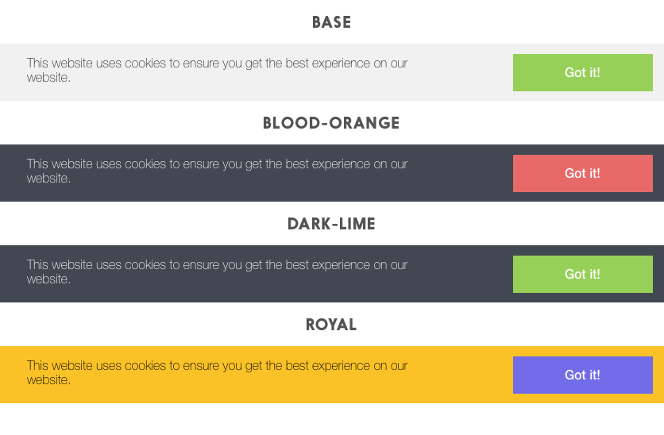

# 🍪 👮 Vue Cookie Bar

## 👈 Usage

```javascript

<template>
  <footer>
    <cookie-bar theme="dark-lime"></cookie-bar>
  </footer>
</template>

<script>
  import Cookiebar from '@/components/Cookiebar'
  export default {
    components: { Cookiebar }
  }
</script>
```

## Props
| prop | default | type | description
|---|---|---|---|
| buttonText | 'Got It!' | String | 🔘 Well, its the button text
| message | 'This website uses cookies to ensure you get the best experience on our website.' | String | Your message in the content area
| theme | 'base' | String | Selected theme. You can also create a custom one
| position | 'bottom' | String | Possible positions are `bottom` or `top`
| transitionName | 'slideFromBottom' | String | Enter and leave transitions. Currenty supported `slideFromBottom`, `slideFromTop`, `fad

## 💅 Themes



### Custom Themes
You can easy create your own themes. The classes that need to be styled are:

- `.cookie` for the container
- `.cookie__content` for the content with message
- `.cookie__button` for the button

If you create your own theme, postfix the class.

```css
.cookie--new-theme {....}
.cookie--new-theme > .cookie__button {....}
```


## :copyright: License

[MIT](http://opensource.org/licenses/MIT)